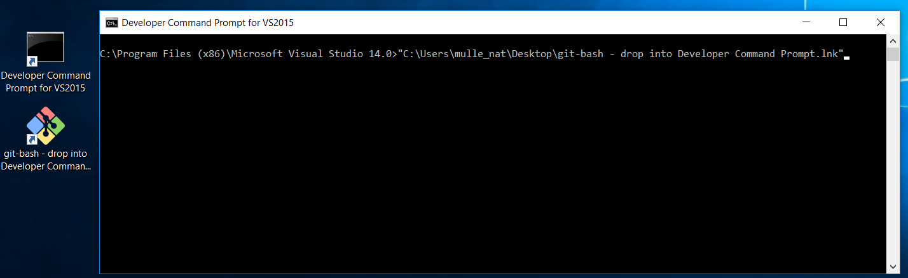

# How to build mulle-clang

Executable          | Description
--------------------|--------------------------------
`mulle-clang`       | The compiler
`mulle-scan-build`  | The analyzer frontend
`mulle-nm`          | Symbol lister


## Prerequisites

You need a fairly current Unix, like Linux, OS X or FreeBSD or you can use
Windows.

Locate a place on your filesystem, where you have at least 8 GB disk space free
after installing all pre-requisites. You probably need not bother to try, if
you have less than 6 GB of RAM. Or you risk seeing
`virtual memory exhausted: Cannot allocate memory`, especially when building
debug binaries.

A docker container usually only has 10 GB of space. That may not be enough to
build the compiler!

If you are configuring a virtual machine, give it some more cores!


## Installing on Linux or FreeBSD

You need the **bash** shell and **curl** (or **wget** )and you may want to
get **sudo** happening to install packages (or run the script as **root**).
bash is usually already present.


<a name="common-generic"></a>
### Common generic instructions


#### 1. Download sources

Get a tarball or zip of [mulle-clang-project](//github.com/mulle-cc/mulle-clang-project/releases/).
Cloning the repository will take forever and just waste space. The instructions
here might be stale, so check out what's new and current:

```
mkdir mulle-clang-140
cd mulle-clang-140
curl -L -O "https://github.com/mulle-cc/mulle-clang-project/archive/refs/tags/14.0.6.0.tar.gz"
```

#### 2. Install prerequisites

Depending on your platform, you may need to install some prerequisites. There
is a script that used to be able to fetch all the prerquisites, but it may have
become stale:

``` bash
./clang/bin/install-prerequisites
```

#### 3. Build and install the compiler

``` bash
# look at available scripts, (use cmake-msbuild.windows on windows inside WSL)
ls mulle-clang-project/clang/bin/*.*

# this will also install,
INSTALL_SUDO=sudo ./clang/bin/cmake-make.linux
```


## Windows: Installing further prerequisites

First, ensure that your username does not contain anything else than
characters and underscores.

* mulle_nat : good
* nat : good
* Nat! : bad
* i am nat : very bad

## Installing on Windows 10 (probably also 7 and 8) with "Git Bash"

> This is a little bit obsolete. Use WSL to build a "native" compiler for Visual Studio.

* Install [Visual Studio 2015 Community Edition](//beta.visualstudio.com/downloads/) or better (free). Make sure that you install Windows C++ support. Also add git support.
* [Git for Windows](//git-scm.com/download/win) is included in VS 2015, make sure it's there
* [Python 2 for Windows](//www.python.org/downloads/windows/). **Make sure that python is installed in **PATH**, which is not the default**
* [CMake for Windows](//cmake.org/download/). CMake should also add itself to **PATH**.
* [Ninja](https://github.com/ninja-build/ninja/releases). Get Ninja and put it in your **PATH**
* [Swig](http://www.swig.org/download.html). This may be optional. But put it in your **PATH** anyway.

Reboot, so that Windows picks up the **PATH** changes (Voodoo).

Now the tricky part is to get the "Git bash" shell running with the proper VS
environment.  Assuming you kept default settings the "Git bash" is
`C:\Program Files\Git\git-bash.exe`. Open the "Developer Command Prompt for VS 2015"
from the start menu and execute the git-bash from there.

>
> You can also just drag the Git bash icon into the
> developer command prompt.
>
> 
>

A second window with the bash should open.
Then continue with [Common generic instructions](#common-generic).

